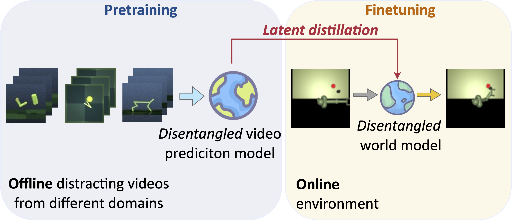
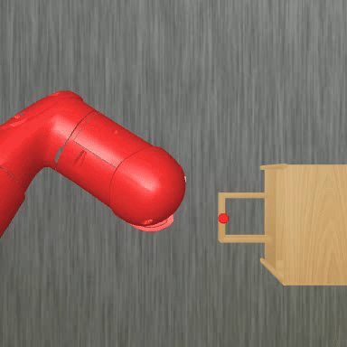
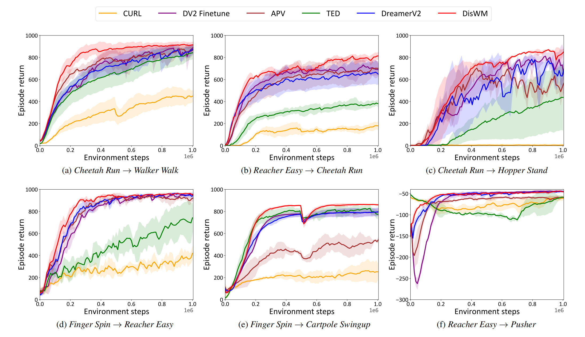

<h1 align="center">
 [ICCV 2025] <i>Disentangled World Models: Learning to Transfer Semantic Knowledge from Distracting Videos for Reinforcement Learning</i> </h1>

<!-- # Disentangled World Models: Learning to Transfer Semantic Knowledge from Distracting Videos for Reinforcement Learning -->

<p align="center">
    Qi Wang*
    ·
    Zhipeng Zhang*
    ·
    Baao Xie*
    ·
    Xin Jin†
    ·
    Yunbo Wang
    ·
    Shiyu Wang
    ·
    Liaomo Zheng
    ·
    Xiaokang Yang
    ·
    Wenjun Zeng
  </p>

<h3 align="center"> <a href="https://huggingface.co/datasets/MrSC320/DisWM-Pretrain-Datasets" target="_blank">  </a> &nbsp;&nbsp; |&nbsp;&nbsp;   <a href="https://arxiv.org/pdf/2503.08751" target="_blank">  </a> &nbsp;&nbsp; | &nbsp;&nbsp; <a href="https://qiwang067.github.io/diswm" target="_blank">  </a> &nbsp;&nbsp; </h3>
  <div align="center"></div>
<p align="center">
  <a href="#quick-start"><b>⚡ Quick Start</b></a> |
  <a href="#datasets-download"><b>📥 Datasets Download</b></a> |
  <a href="#citation"><b>📝 Citation</b></a> <br>
</p>

<p align="center">

</p>

<p style="text-align:justify">
  Training visual reinforcement learning (RL) in practical scenarios presents a significant challenge, <i>i.e.</i>, RL agents suffer from low sample efficiency in environments with variations.
  While various approaches have attempted to alleviate this issue by disentanglement representation learning, these methods usually start learning from scratch without prior knowledge of the world. This paper, in contrast, tries to learn and understand underlying semantic variations from distracting videos via offline-to-online latent distillation and flexible disentanglement constraints.
  To enable effective cross-domain semantic knowledge transfer, we introduce an interpretable model-based RL framework, dubbed Disentangled World Models (DisWM). Specifically, we pretrain the action-free video prediction model offline with disentanglement regularization to extract semantic knowledge from distracting videos. The disentanglement capability of the pretrained model is then transferred to the world model through latent distillation.
  For finetuning in the online environment, we exploit the knowledge from the pretrained model and introduce a disentanglement constraint to the world model.
  During the adaptation phase, the incorporation of actions and rewards from online environment interactions enriches the diversity of the data, which in turn strengthens the disentangled representation learning.
  Experimental results validate the superiority of our approach on various benchmarks.
</p>

## Showcases
<table style="margin: auto;">
<table class="center">
  <h3 align="center"> DMC Humanoid Walk</h3>
  <tr>
    <td align="center">DisWM</td>
    <td align="center">TD-MPC2</td>
    <td align="center">ContextWM</td>
  </tr>
  <tr>
    <td>
      
    </td>
    <td>
      
    </td>
    <td>
      
    </td>
  </tr>
  </table>
  <table class="center">
  <h3 align="center"> Drawerworld Open</h3>
  <tr>
    <td align="center">DisWM</td>
    <td align="center">TD-MPC2</td>
    <td align="center">ContextWM</td>
  </tr>
    <tr>
    <td>
      
    </td>
    <td>
      
    </td>
    <td>
      
    </td>
  </tr>
</table>


## Quick Start
DisWM is implemented and tested on Ubuntu 22.04 with python == 3.9, PyTorch == 1.8.1:

1) Create an environment
```bash
conda create -n diswm python=3.9
conda activate diswm
```
2) Install dependencies
```bash
pip install -r requirements.txt
```

3) Install Distracting Control Suite and dmc2gym. The `distracting_control` folder contains the [Distracting Control Suite](https://github.com/sahandrez/distracting_control) code with modification to create disjoint colour sets. The `dmc2gym` folder contains the [dmc2gym](https://github.com/denisyarats/dmc2gym) code revised to use the distracting_control wrappers.

4) Install Drawerworld.
```bash
cd env/drawerworld
pip install -e .
```

5) Collect distracting video datasets with DreamerV2 on DMC/MuJoCo Pusher. 

6) We provide two options for recording data during the training process: TensorBoard and Weights & Biases (wandb).

## Train DisWM on DMC / MuJoCo Pusher / Drawerworld
1. Pretrain the video prediction model with collected videos on DMC:  
```bash
python dreamer.py --configs defaults dmc2gym \
    --device 'cuda:0' --task dmc2gym_reacher_easy \
    --logdir $log_directory \
    --seed 0 --beta_vae_pretrain True --beta_vae True \
    --pretrain_action_num $source_task_action_number \
    --pretrain_datasets_path $dataset_directory/train_eps
```
Put pretrained checkpoints into `checkpoints` folder. 

2. (a) Finetune the disentangled world model on DMC Walker Walk:  
```bash
python dreamer.py --device 'cuda:0' --task dmc2gym_walker_walk \
    --logdir $log_directory \
    --pretrain_checkpoint_path ./checkpoints \
    --seed 0 --configs defaults dmc2gym --traverse True --beta_vae True \
    --method_name 'diswm' --cross_domain False \
    --source_action_num $source_task_action_number --action_num_gap $action_num_gap \
    --distillation True --color_distractor True
```

2. (b) Finetune the disentangled world model on MuJoCo Pusher:  
```bash
python dreamer.py --device 'cuda:0' --task gymnasium_Pusher-v5 \
    --logdir $log_directory \
    --pretrain_checkpoint_path ./checkpoints \
    --seed 0 --configs defaults gymnasium --traverse True --beta_vae True \
    --method_name 'diswm' --cross_domain True \
    --source_action_num $source_task_action_number --action_num_gap $action_num_gap \
    --distillation True --color_distractor True
```

2. (c) Finetune the disentangled world model on Drawerworld Open:  
```bash
python dreamer.py --device 'cuda:0' --task metaworld_drawer-open-v1 \
    --logdir $log_directory \
    --pretrain_checkpoint_path ./checkpoints \
    --seed 0 --configs defaults metawolrd --traverse True --beta_vae True \
    --method_name 'diswm' --cross_domain True \
    --source_action_num $source_task_action_number --action_num_gap $action_num_gap \
    --distillation True --color_distractor True
```

## Datasets Download
We provide a dataset collected from three different tasks `(Cheetah Run, Finger Spin, Reacher Easy)` in DMC for pretrain **DisWM**. 

<div align="center">

| Task Name                  | File Name                                                                                   |
|----------------------------|-----------------------------------------------------------------------------------------------|
| Cheetah Run                | [cheetah_run.tar.xz](https://huggingface.co/datasets/MrSC320/DisWM-Pretrain-Datasets/resolve/main/cheetah_run.tar.xz)   |
| Finger Spin                | [finger_spin.tar.xz](https://huggingface.co/datasets/MrSC320/DisWM-Pretrain-Datasets/resolve/main/finger_spin.tar.xz)   |
| Reacher Easy               | [reacher_easy.tar.xz](https://huggingface.co/datasets/MrSC320/DisWM-Pretrain-Datasets/resolve/main/reacher_easy.tar.xz) |
| Walker Walk                | [walker_walk.tar.xz](https://huggingface.co/datasets/MrSC320/DisWM-Pretrain-Datasets/resolve/main/walker_walk.tar.xz) |

</div>

## Citation 
If you find this repo useful, please cite our paper:
```bib
@inproceedings{wang2025disentangled,
    title={Disentangled World Models: Learning to Transfer Semantic Knowledge from Distracting Videos for Reinforcement Learning}, 
    author={Qi Wang and Zhipeng Zhang and Baao Xie and Xin Jin and Yunbo Wang and Shiyu Wang and Liaomo Zheng and Xiaokang Yang and Wenjun Zeng},
    booktitle={ICCV},
    year={2025}
}
```

## Acknowledgement
The codes refer to the implemention of [dreamer-torch](https://github.com/jsikyoon/dreamer-torch). Thanks for the authors！


